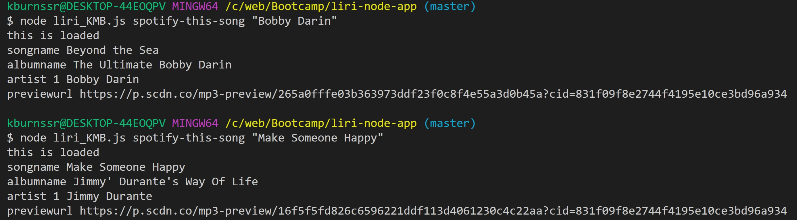
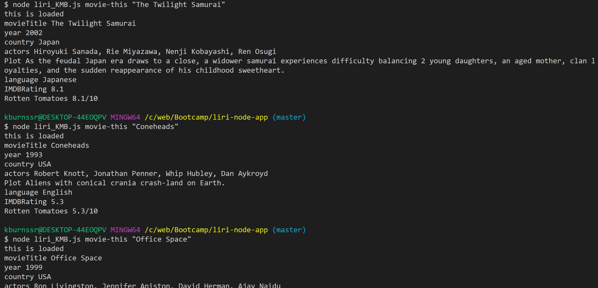
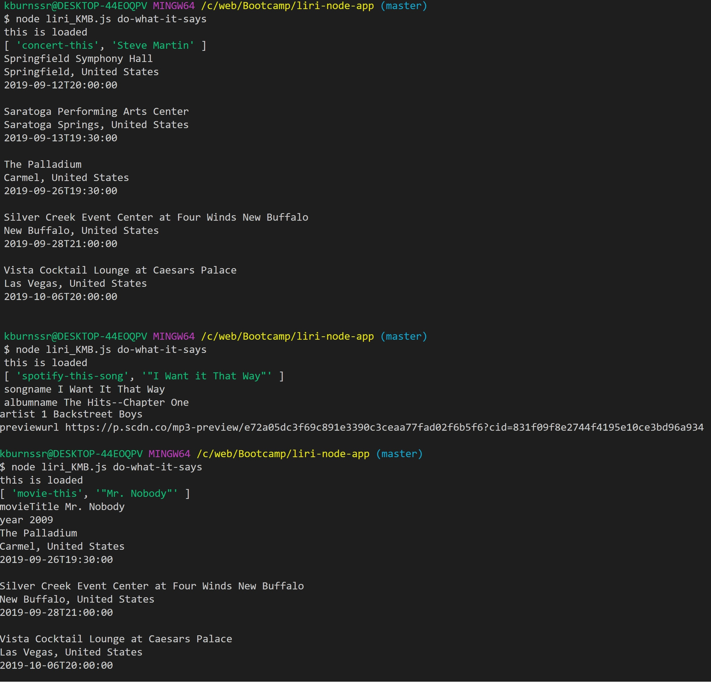

This is a node.js file that takes the following commands:

* concert-this       
* spotify-this-song
* movie-this
* do-what-it-says

In the terminal, the command line is used as follows:  
$ node liri_KMB.js command artist(or band)/song/movie

"concert-this" uses Axios to grab data from the [Bands In Town API](http://www.artists.bandsintown.com/bandsintown-api)  
The name of a artist/band is used and the following data are returned:
* Name of the venue
* Venue location
* Date of the Event (use moment to format this as "MM/DD/YYYY")  

Example:  

"spotify-this-song" uses the Node-Spotify-API ((https://www.npmjs.com/package/node-spotify-api) to return:
* Artist name(s)
* The song's name
* A preview link of the song from Spotify
* The album name

Example: 

"movie-this" uses Axios to retrieve data from the [OMDB API](http://www.omdbapi.com) and returns:
* Title of the movie.
* Names of actors in the movie.
* Year the movie came out.
* Plot of the movie.
* Country where the movie was produced.
* Language of the movie.
* IMDB Rating of the movie.
* Rotten Tomatoes Rating of the movie. (not all movie entries provide Rotten Tomatoe ratings)

Example:   

"do-what-it-says" uses each of the three commands below by editing the random.txt file
* "spotify-this-song"
* "movie-this"
* "concert-this"

Example: 

Created log.txt file 

